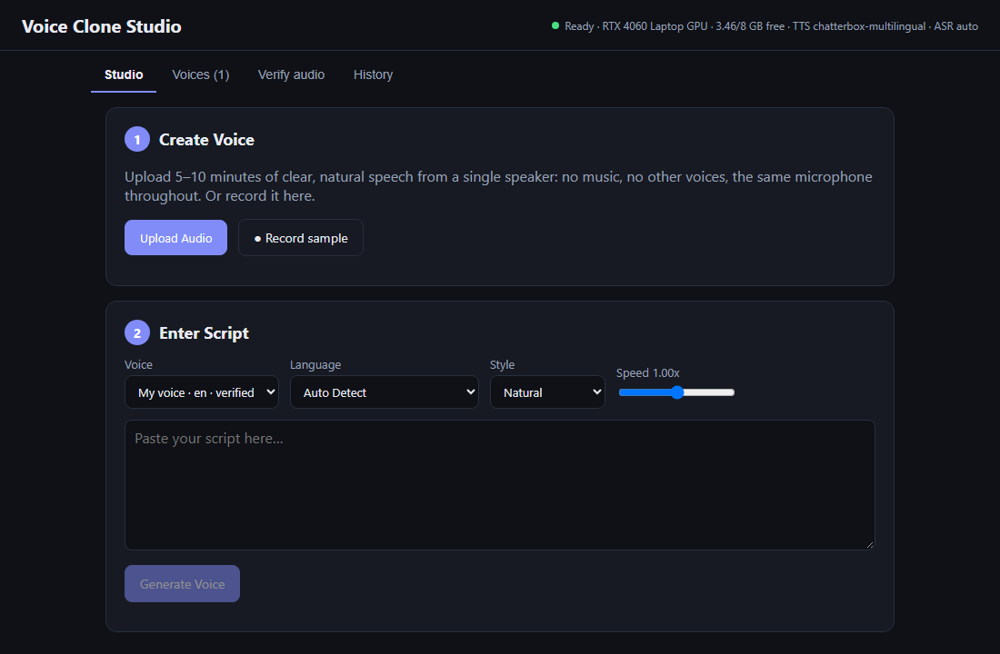
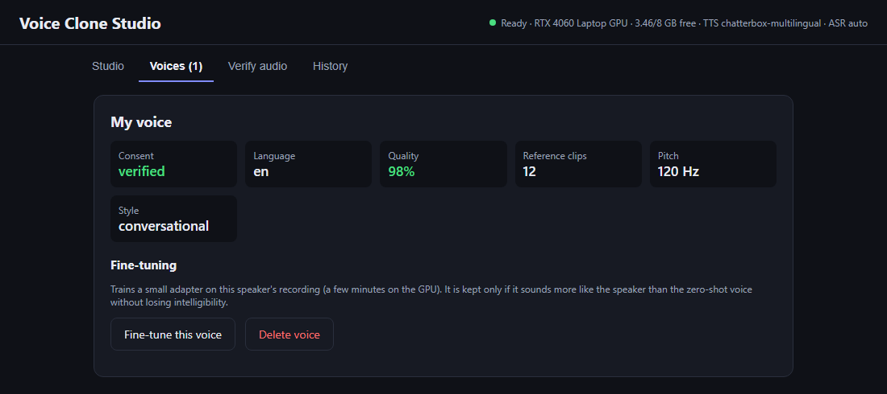

<div align="center">

# 🎙️ Voice Clone Studio

### Type a script. Hear it in your own voice.

**Hindi · Hinglish · English — 100% on your own PC, nothing uploaded.**

[](https://github.com/Hydra-Of-Malice/voice-clone-studio/releases/latest)




</div>

Record 5–10 minutes of your voice once. After that, paste any script and get studio-quality audio
back in seconds: narration for videos, podcasts, reels, lessons or audiobooks, without sitting in front
of a microphone again.

## ✨ Why you'll like it

| | |
|---|---|
| 🗣️ **Sounds like you** | Clones your voice from one short recording, with an optional one-minute fine-tune that is kept only if it really sounds closer to you |
| 🇮🇳 **Built for Hinglish** | Write `Aaj hum AI ke baare mein baat karenge` or `आज हम AI के बारे में बात करेंगे` — both work, and English words stay English |
| 🔒 **Private by design** | Everything runs on your GPU. Your recordings never leave your computer |
| ⚡ **One installer** | No Python, no setup, no model downloads. Install and start |
| 🎚️ **Ready to publish** | 48 kHz 24-bit WAV and 320 kbps MP3, loudness-normalised, in four speaking styles |
| 🧹 **Forgiving** | Scores your recording, tells you how to improve it, and cleans background noise automatically |
| ✅ **Safe** | Spoken consent is required, and every file is watermarked and labelled as AI-generated |

## 🚀 Three steps

<div align="center">

</div>

1. **Create your voice** — upload or record 5–10 minutes of yourself speaking.
2. **Confirm it's you** — read a short statement aloud.
3. **Type and generate** — paste a script, pick a style, download the audio.

> **Use it only with your own voice, or with the clear agreement of the speaker.**
> See [Responsible use](#responsible-use).

## 📥 Download

Get the installer from the [Releases page](https://github.com/Hydra-Of-Malice/voice-clone-studio/releases).

1. Download **every file** of the release (`VoiceCloneStudio-Setup-x.y.z.exe` and all the `.bin` files)
   into the **same folder**.
2. Run the `.exe`. Windows SmartScreen may warn that the publisher is unknown, because the installer is
   not code-signed: choose **More info → Run anyway**.
3. Start **Voice Clone Studio** from the Start menu or the desktop shortcut.

No Python, no downloads at first start: the runtime and all models are inside the installer.
Step-by-step help is in the [user guide](docs/USER-GUIDE.md).

### Requirements

| | |
|---|---|
| Operating system | Windows 10 or 11, 64-bit |
| Graphics card | NVIDIA with **8 GB** of memory (RTX 20, 30, 40 or 50 series), driver 572 or newer |
| Not supported | Cards with less than 8 GB of memory, AMD and Intel graphics, computers without a GPU |
| Disk space | about 15 GB installed, 30 GB free while installing |
| Browser | Microsoft Edge (part of Windows) for the app window |

## What it does

| Step | What happens |
|---|---|
| **1. Create voice** | The recording is checked (noise, clipping, bandwidth, length, number of speakers) and scored from 0 to 100 with advice on how to improve it. Noisy recordings are cleaned automatically. The speech is transcribed in its original language. |
| **Consent** | The speaker reads a statement with random code words. The words, the voice and the absence of an AI watermark are all checked before anything can be generated. |
| **2. Enter script** | Hindi in Devanagari, romanised Hinglish or English. Numbers, currency and abbreviations are spelled out, and you see exactly what will be spoken before generating. Styles: natural, conversational, professional, energetic. Speed 0.8x to 1.2x. |
| **3. Preview** | Play, regenerate, download WAV (48 kHz, 24-bit) or MP3 (320 kbps). A similarity score compares the result with the speaker's own recordings. |
| **Fine-tune** (optional) | About a minute of training adapts the model to the speaker. The result is kept only if it sounds more like the speaker without becoming harder to understand. |
| **Verify audio** | Tells you whether a file was generated by this app or carries an AI-speech watermark. |

## How it works

```
recording ─► clean-up ─► quality score ─► transcript ─► speaker profile (encrypted)
                                                              │
                                        spoken consent ───────┤
                                                              ▼
script ─► language + text normalisation ─► voice-cloning TTS ─► loudness, watermark,
                                                                 signed provenance ─► WAV / MP3
```

| Stage | Component | License |
|---|---|---|
| Voice activity detection | Silero VAD | MIT |
| Noise reduction | DeepFilterNet3 (only below 20 dB SNR) | MIT / Apache-2.0 |
| Speech recognition, Hindi and Hinglish | Trelis whisper-hinglish-preview | Apache-2.0 |
| Speech recognition, other languages | Whisper large-v3-turbo (faster-whisper) | MIT |
| Speaker verification | SpeechBrain ECAPA-TDNN | Apache-2.0 |
| Text to speech | Resemble Chatterbox Multilingual, with optional per-speaker LoRA | MIT |
| Watermarks | Resemble Perth, Meta AudioSeal | MIT |
| Provenance | C2PA Content Credentials | MIT / Apache-2.0 |

Every stage sits behind a small interface and is registered in `vc/registry.py`, so engines can be
replaced without touching the pipeline. Voice profiles are independent of the TTS engine: they hold
reference clips, transcripts and a generic speaker embedding.

The API server (`vc.main`) never loads a model. It supervises a separate GPU worker (`vc.worker`) that
takes jobs from a SQLite queue and is restarted automatically if it crashes.

## Responsible use

- Create voice profiles only from your own voice, or with the speaker's explicit agreement.
- Do not use generated speech to impersonate, deceive, harass or defraud anyone. In many countries this
  is a criminal offence, and cloning a public figure's voice can violate their personality rights.
- Generation is refused until the speaker has read the consent statement aloud. Recordings that carry an
  AI-speech watermark are refused both as voice samples and as consent.
- Every output carries two inaudible watermarks and a signed Content Credentials manifest that marks it
  as AI-generated. Do not remove them.
- Deleting a voice in the **Voices** tab erases its clips, embeddings and fine-tunes.

Limits you should know about: the Content Credentials are signed with a locally generated development
certificate, so validators report the signer as untrusted. Watermarks survive MP3 encoding but not
re-recording or neural audio codecs, so a missing watermark never proves that a recording is genuine.

## Known limits

- Tested with English voices; Hindi and Hinglish were tested on generated speech, not yet on many real
  Hindi speakers. Speaking a language other than the one in the recording lowers the similarity.
- Rare romanised Hindi words can be transliterated wrongly. The script box shows the text that will be
  spoken and lets you correct it; Devanagari input is the most reliable.
- One GPU job runs at a time. Other programs that use the GPU can cause out-of-memory errors.
- The installer is not code-signed.

## Development

Requirements: Windows, Python 3.11, [uv](https://docs.astral.sh/uv/), Node.js 20, MSVC Build Tools.

```powershell
powershell -ExecutionPolicy Bypass -File scripts\setup.ps1      # venv, PyTorch cu128, dependencies, web build
.venv\Scripts\python -m vc.main                                 # http://127.0.0.1:8765
.venv\Scripts\python -m pytest tests -q
```

Models are downloaded on first use to `%USERPROFILE%\.voice-clone\models`.

| Path | Contents |
|---|---|
| `vc/` | Python package: API, worker, pipeline, engines, text front end, provenance, fine-tuning |
| `web/` | React + Vite user interface (`npm run dev` proxies the API) |
| `tests/` | Unit tests |
| `scripts/` | Setup, end-to-end tests, runtime / model / installer builds |
| `installer/` | Inno Setup script |
| `docs/` | User guide |

Configuration is by environment variable (`VC_ASR`, `VC_TTS`, `VC_DATA_DIR`, `VC_WORKER_MODE`,
`VC_C2PA_CERT`, …); see `vc/config.py`.

### Building the installer

```powershell
powershell -ExecutionPolicy Bypass -File scripts\build-runtime.ps1     # build\runtime-cu128 (about 6 GB)
.venv\Scripts\python scripts\build-models.py                           # build\models   (about 8 GB)
powershell -ExecutionPolicy Bypass -File scripts\build-installer.ps1   # build\installer\*.exe + *.bin
```

### HTTP API

`POST /api/upload` · `POST /api/transcribe` · `POST /api/analyze-voice` · `POST /api/create-profile` ·
`POST /api/consent/statement` · `POST /api/consent/verify` · `POST /api/text/preview` ·
`POST /api/generate` · `POST /api/fine-tune` · `POST /api/verify-audio` · `GET /api/jobs/{id}` ·
`GET /api/jobs/{id}/events` · `GET /api/audio/{id}?fmt=wav|mp3` · `GET /api/profiles` ·
`DELETE /api/profiles/{id}` · `GET /api/history` · `GET /api/status`

## License

The source code in this repository is © its authors, all rights reserved; no license is granted to reuse
it. The bundled models and libraries keep their own licenses: see
[THIRD-PARTY-NOTICES.md](THIRD-PARTY-NOTICES.md).
